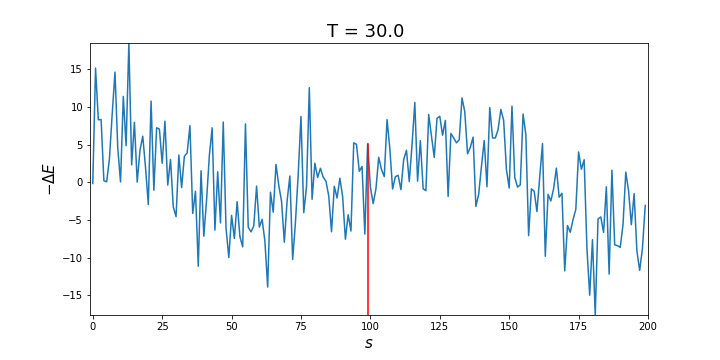

# Simulated Annealing

Simulated annealing (SA) optimization to find the global maximum of a function.

<p align="center">
    
</p>

## Installation
To install the dependencies, run the following command.
```python
pip install -r requirements.txt
```

## Usage
Open and execute the cells in `SimulatedAnnealing.ipynb` from `notebooks/`. 